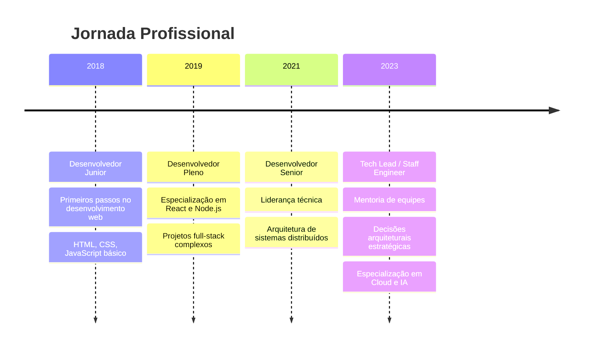

# 🚀 Gabriel Vieira - Desenvolvedor Full Stack

<div align="center">


[](https://vieiragabriel.com.br)
[](https://linkedin.com/in/vieiragabriel)
[](https://github.com/vieiragabriel)

</div>

---

## 🎯 Sobre Mim

> **"Transformando ideias em código, criando soluções que impactam o mundo"**

Sou um **Desenvolvedor Full Stack** apaixonado por tecnologia e inovação. Com expertise em desenvolvimento web moderno, arquitetura de software distribuído e soluções em nuvem, busco sempre criar experiências digitais excepcionais.

### 🌟 Especialidades

```typescript
const gabriel = {
  roles: [
    "Desenvolvedor Full Stack",
    "Engenheiro de Software", 
    "Arquiteto de Software Distribuído",
    "Especialista em Cloud",
    "Tech Lead",
    "Staff Engineer",
    "Especialista em IA",
    "Low-Code & No-Code"
  ],
  currentFocus: "Criando soluções inovadoras com IA e Cloud",
  motto: "Código limpo, arquitetura sólida, resultados excepcionais"
};
```

---

## 🛠️ Stack Tecnológica

<div align="center">

### Frontend


### Backend


### Cloud & DevOps


### Databases


</div>

---

## 🎮 Projetos em Destaque

### 🎯 [Project TGV - Tetris Temporal](https://vieiragabriel.com.br/project-tgv/)
> **Um Tetris além do tempo e espaço**

```javascript
const projectTGV = {
  concept: "Tetris + Viagem no Tempo + Narrativa Épica",
  mission: "Salvar o universo organizando fragmentos temporais",
  features: [
    "🕰️ Viagem através das eras históricas",
    "🌌 Cenários de planetas distantes",
    "⚡ Lore imersiva e narrativa épica",
    "🎨 Visual neon futurista"
  ],
  status: "🚀 Lançado"
};
```

### 💭 Wishlist de Projetos

<details>
<summary>🎨 <strong>Projetos em Desenvolvimento</strong></summary>

#### 📖 **Diário Digital Inteligente**
- **Status:** 🔄 Em desenvolvimento
- **Tech:** React, IA, NLP
- **Conceito:** Diário que entende emoções e sugere reflexões

#### 💬 **Chat Multiverse**
- **Status:** 💡 Planejamento
- **Tech:** WebRTC, Socket.io, React
- **Conceito:** Chat que conecta diferentes realidades

#### 🧱 **Block Builder Pro**
- **Status:** 🔄 Em desenvolvimento
- **Tech:** Three.js, WebGL, React
- **Conceito:** Constructor 3D colaborativo

#### 🎨 **AI Art Studio**
- **Status:** 💡 Conceito
- **Tech:** Stable Diffusion, React, Python
- **Conceito:** Estúdio de arte com IA generativa

</details>

---

## 📊 GitHub Stats

<div align="center">


</div>

---

## 🎓 Formação & Certificações

### 🎓 **Educação**
- **Análise e Desenvolvimento de Sistemas** - FATEC (2019-2021)
- **Técnico em Informática** - ETEC (2017-2018)

### 🏆 **Certificações**
- ☁️ **AWS Solutions Architect**
- 🔵 **Azure Fundamentals**
- ⚛️ **React Advanced Patterns**
- 🐍 **Python Professional**
- 🚀 **Node.js Expert**

---

## 🌟 Experiência Profissional



---

## 🎯 Objetivos 2024

- [ ] 🤖 **Especialização em IA Generativa**
- [ ] ☁️ **Certificação AWS Solutions Architect Professional**
- [ ] 🚀 **Lançar 3 projetos open source**
- [ ] 📝 **Escrever 12 artigos técnicos**
- [ ] 🎤 **Palestrar em 5 eventos de tecnologia**
- [ ] 🌟 **Mentorar 10 desenvolvedores iniciantes**

---

## 📈 Atividade Recente

<!--START_SECTION:activity-->
<!--END_SECTION:activity-->

---

## 🤝 Vamos Conectar?

<div align="center">

### 💬 **"Sempre aberto para novos desafios e colaborações!"**

[](https://vieiragabriel.com.br)
[](https://linkedin.com/in/vieiragabriel)
[](mailto:contato@vieiragabriel.com.br)
[](https://github.com/vieiragabriel)

</div>

---

<div align="center">

### 🚀 **Transformando o futuro, uma linha de código por vez**


**⭐ Se você chegou até aqui, que tal dar uma estrela no repositório? ⭐**

</div>

---

<div align="center">
<sub>💜 Feito com amor e muito café por <a href="https://vieiragabriel.com.br">Gabriel Vieira</a></sub>
</div>